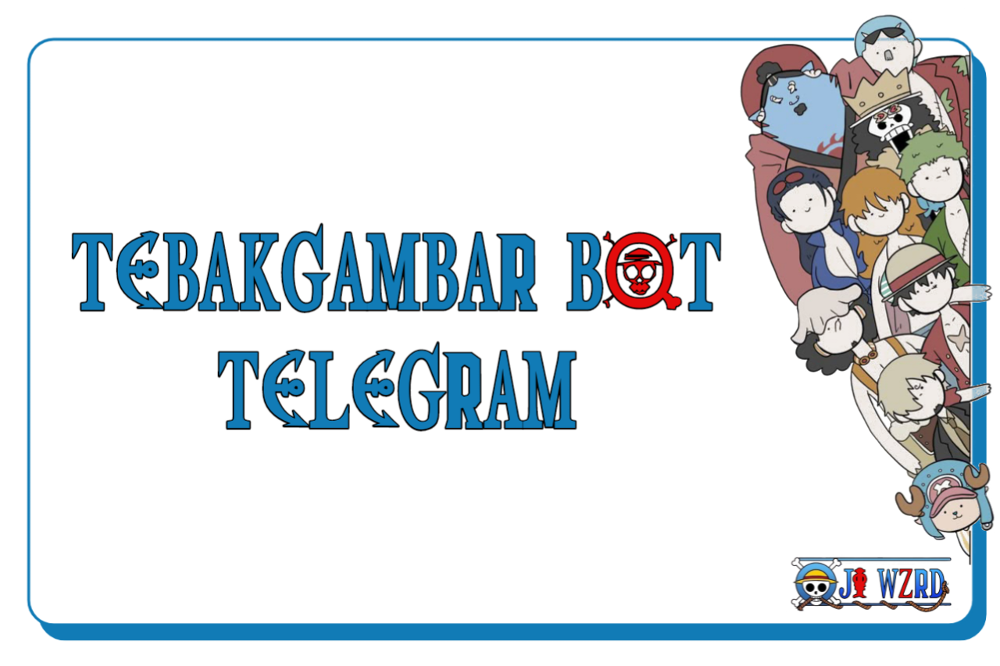

# Tebakgambar Bot


TebakGambar Bot adalah bot Telegram untuk bermain tebak gambar dengan teman group, Dibangun dengan library [telegraf](https://www.npmjs.com/package/telegraf), lowdb untuk penyimpanan lokal, dan y18n untuk dukungan multi-bahasa.

## Dukungan Bahasa Tersedia
- 🇮🇩 Indonesia (id)  
- 🇺🇸 English (en)  
- 🇪🇸 Español (es)  
- 🇫🇷 Français (fr)  
- 🇩🇪 Deutsch (de)  
- 🇯🇵 日本語 (ja)  
- 🇨🇳 中文 (zh)  
- 🇷🇺 Русский (ru)  
- 🇰🇷 한국어 (ko)  
- 🇸🇦 العربية (ar)

## Instalasi 
```bash
git clone https://github.com/ojiwzrd/tebakgambar-bot.git
cd tebakgambar-bot
npm install
npm start
```
